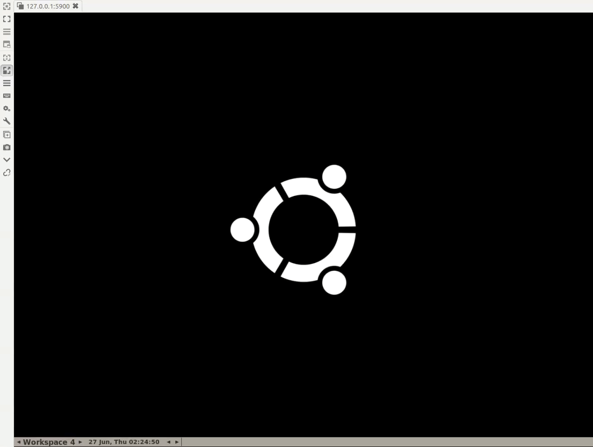

# MFTF to MailHog wrapper

[](https://circleci.com/gh/M2Coach/MFTF-MailHog-Wrapper/tree/master) 

## What is it about?

* [Magento Functional Testing Framework](https://github.com/magento/magento2-functional-testing-framework/) is complete Acceptance Testing solution delivered OOTB with Magento 2.
* [MailHog](https://github.com/mailhog/MailHog) is a tool installed along the web project, used to test e-mail sending during development of application.

## Why you should use it?

Does your project look professional, if you deliver to your client a web store which welcomes Customers after registration with e-mail of Subject: **Welcome to {{StoreName}}** and contents beginning with **Hello {{FirstName}} {{LastName}},**. I think it's not. That's why I want to help you with avoiding such embarassing moments.

The best way is to test what e-mails are sent to the customers, just like the live website does. But we should not reinvent the wheel! There are tons of solutions that help you to verify how e-mails are sent, without using real SMTP account. One of them is MailHog, which behaves (for application) just like regular SMTP server, except the fact, that messages are not sent over the Internet.

## Demo



## Installation

* Get the package
    ```bash
    $ composer require m2coach/mftf-mailhog-wrapper
    ```

* Configure MailHog URL in `/dev/tests/acceptance/.env`
    ```
    MAILHOG_BASE_URL=http://mailhog:8025/
    ```

## Usage

### Action Groups provided

* Verify if Inbox is empty:

    ```xml
    <actionGroup ref="OpenInboxActionGroup" stepKey="openInbox"/>
    <actionGroup ref="AssertNoMessagesActionGroup" stepKey="assertNoMessages"/>
    ```

* Open Message by it's Index (nth row)

    ```xml
    <actionGroup ref="OpenInboxActionGroup" stepKey="openInbox"/>
    <actionGroup ref="OpenNthMessageActionGroup" stepKey="openNthMessage">
        <argument name="row" value="2"/>
    </actionGroup>
   ```
   
* Open Message by it's Subject and Index

   ```xml
    <actionGroup ref="OpenInboxActionGroup" stepKey="openInbox"/>
    <actionGroup ref="OpenNthMessageBySubjectActionGroup" stepKey="openNthMessage">
        <argument name="row" value="1"/>
        <argument name="subject" value="Welcome to"/>
    </actionGroup>
   ```
  
* Open Message by it's Recipient and Index

   ```xml
    <actionGroup ref="OpenInboxActionGroup" stepKey="openInbox"/>
    <actionGroup ref="OpenNthMessageByRecipientActionGroup" stepKey="openNthMessage">
        <argument name="row" value="1"/>
        <argument name="recipient" value="awesome@feature.com"/>
    </actionGroup>
   ```
  
* Open Message by it's Recipient, Subject and Index

   ```xml
    <actionGroup ref="OpenInboxActionGroup" stepKey="openInbox"/>
    <actionGroup ref="OpenNthMessageByRecipientAndSubjectActionGroup" stepKey="openNthMessage">
        <argument name="row" value="1"/>
        <argument name="recipient" value="awesome@feature.com"/>
        <argument name="subject" value="Welcome to"/>
    </actionGroup>
   ```
  
* Verify e-mail subject

    ```xml
     <actionGroup ref="AssertSubjectActionGroup" stepKey="assertSubject">
         <argument name="expectedSubject" value="Welcome to Main Website Store"/>
     </actionGroup>
    ```
  
* Verify e-mail sender

    ```xml
     <actionGroup ref="AssertSenderActionGroup" stepKey="assertSender">
         <argument name="expectedSender" value="learn@mftf.test"/>
     </actionGroup>
    ```
  
* Verify e-mail recipient

    ```xml
     <actionGroup ref="AssertRecipientActionGroup" stepKey="assertRecipient">
         <argument name="expectedRecipient" value="subscribe@mftf.test"/>
     </actionGroup>
    ```
  
* Delete All Messages
    ```xml
    <actionGroup ref="DeleteAllMessagesActionGroup" stepKey="deleteAllMessages"/>
    ```
  
* Delete currently opened Message
    ```xml
    <actionGroup ref="DeleteCurrentMessageActionGroup" stepKey="deleteSingleMessage"/>
    ```
   
### Selectors provided

* Inbox Grid (`InboxGridSection`)

  * Inbox Container (`InboxContainer`)
  * Message row (`MessageRow`)
  * Message row by it's index (`NthMessageRow(#)`)
  * Message row by recipient and it's index (`NthMessageRowByRecipient(Subject, #)`)
  * Message row by recipient, subject and it's index (`NthMessageRowByRecipientAndSubject(Recipient, Subject, #)`)
  * Message row by subject and it's index (`NthMessageRowBySubject(Subject, #)`)
  * Delete All Messages button (`DeleteAllButton`)
  * Delete All Messages confirmation button (`DeleteAllConfirmationButton`)
  
* Single Message (`MessageSection`)
  
  * Sender (`Sender`)
  * Recipient (`Recipient`)
  * Subject (`Subject`)
  * Contents (`Content`)
  * Delete Message button (`DeleteMessageButton`)

## License

Copyright &copy; 2019, Łukasz Bajsarowicz [M2.coach](https://m2.coach)

Releases under MIT license, see [LICENSE](LICENSE.md) for details.